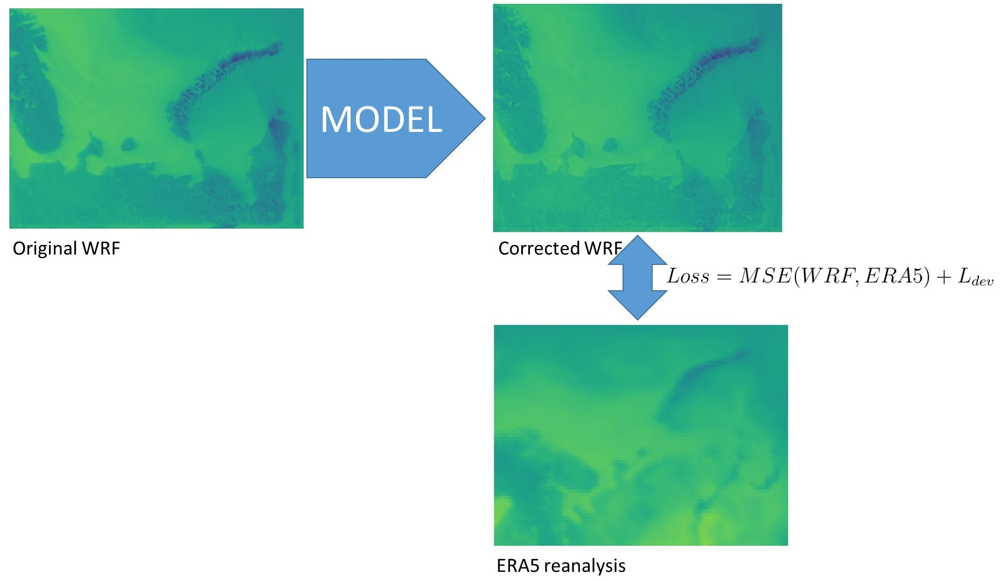
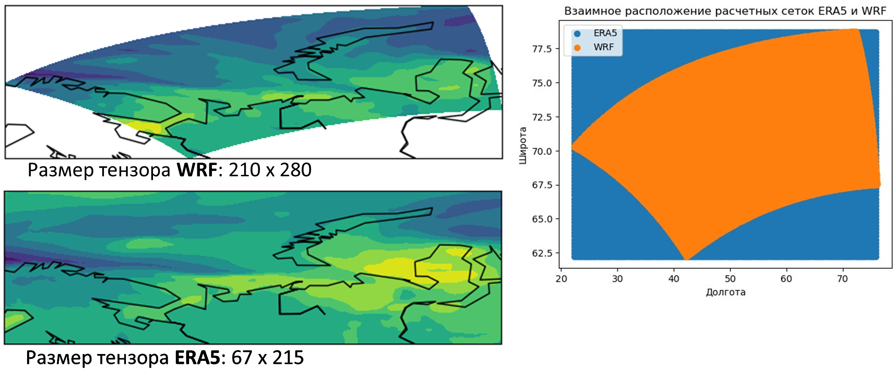

# RSVbaseline
Для запуска бейзлайна коррекции прогнозов численной модели wrf в директории `./experiments/constantBaseline/` запускаем файл `main.py`

```sh
cd /path/to/project/dir/experiments/constantBaseline
python main.py
```

Для удачного запуска в переменных `wrf_folder` и `wrf_folder` укажите актуальные директории с данными WRF и ERA5. 
Также в файле `correction/config.py` укажите актуальный путь к проекту:
```python
__C.GLOBAL.BASE_DIR = 'path to project'
```
## Docker
Проект можно запустить внутри Docker контейнера. В проекте есть Dockerfile для сброки небходимого образа. В случае пользования docker путь к данным менять не нужно

```sh
cd /path/to/project
docker build ./ -t baseline_wrf_correction 
docker run -it --rm --name correction_baseline \
	-v /path/to/wrf/files/.:/home/wrf_data \
	-v /path/to/era5/files/.:/home/era_data \
	-v $(pwd)/logs/.:/home/logs \
	--gpus device=0 --ipc=host golikov_wrf_correction
```

Оказавшись таким образом внутри контейнера запускаем скрипт с обучением:
```sh
python main.py
```
## Метрика качества и функция потерь


Функция ошибки - сумма двух слагаемых. Первое $MSE(WRF, ERA5)$ отвечает за уменьшение статистического отклонения, второе $L_{dev}$ - за сохранение мелкомасштабной динамики.

$$L_{dev} = (\delta WRF_{corr} - \delta WRF)^2,$$
где $$\delta WRF = WRF - WRF.mean()$$

Итоговая функция ошибки выглядит так:
$$Loss = MSE(WRF, ERA5) + L_{dev}$$

**Метрика качества - уменьшение Loss относительно нескорректированного примера:**
$$M = max(\frac{Loss(WRF_{orig})-Loss(WRF_{corr})}{Loss(WRF_{orig})}, 0)$$

## Данные 
Для обучения предоставлены данные численного моделирования атмосферы WRF за год, а также данные реанализа ERA5 в том же домене за то же время. Для тестирования будут использованы небольшие выборки по 25 сэмплов данных для каждого сезона года.

Датасет состоит из двух наборов массивов пространственно-временных рядов: 
1) Прогноз численной модели погоды WRF. Именно его нужно скорректировать. Это набор файлов, каждый из которых - numpy массив размера (24, 3, 210, 280)
	+ 24 - прогноз делается на каждый час суток. дата указана в имени файла
	+ 3 - каналы данных, (u10, v10, t2) - скорость ветра по широте и долготе на высоте 10 метров и температура на 2х метрах
	+ 210, 280 - размер домена в котором считается прогноз (то же самое, что h и w в цифровых изображениях)

2) ERA5 данные реанализа - грубо говоря, это данные наблюдений, разглаженные на сетку. Относительно этого реанализа предлагается скорректировать прогноз. Это набор файлов, каждый из которых - numpy массив размера (24, 3, 67, 215)
	+ 24 - реанализ также считается каждый час суток. дата указана в имени файла
	+ 3 - те же каналы данных, (u10, v10, t2) - скорость ветра по широте и долготе на 10 метрах и температура на 2х метрах
	+ 210, 280 - размер домена в котором проведен реанализ. 

Сетки на которых расчитываются эти данные не согласованы! 
+ ERA5 считается на географической сетке с разрешением 0.25 градусов.
+ WRF же считается на кастомной сетке более высокого разрешения в 6 км (это видно по размерам массивов (210, 280) vs (67, 215)).


## Полезные ссылки

Для более подробного ознакомления, с какими данными мы работаем, можно пройти по следующим ссылкам:

- [ERA5] - Ссылка на официальный сайт ERA5 (нужен VPN) 
- [WRF] - Ссылка на официальный сайт WRF 


   [ERA5]: <https://cds.climate.copernicus.eu/cdsapp#!/dataset/reanalysis-era5-single-levels?tab=overview>
   [WRF]: <https://www.mmm.ucar.edu/models/wrf>

